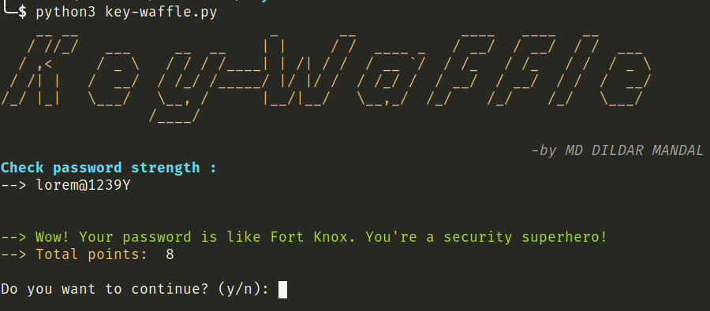

# Key-Waffle

A simple Python script to check the strength of passwords based on various criteria, including length, character types, and the presence of special characters.

## Table of Contents
- [Introduction](#introduction)
- [Features](#features)
- [Installation](#installation)
- [Usage](#usage)
- [Dependencies](#dependencies)
- [License](#license)
- [Author](#author)

## Introduction

This script uses a combination of length, character types (uppercase, lowercase, numbers, special characters), and checks against a common password database to determine the strength of a given password.

## Features

- Password length check
- Character type check (uppercase, lowercase, numbers, special characters)
- Reverse password checks
- Database check for commonly used passwords
- Color-coded output for visual feedback
- Option to continue checking passwords

## Screenshot


## Installation

1. Clone the repository:

    ```bash
    git clone https://github.com/MD-DILDAR-MANDAL/key-waffle.git
    ```

2. Navigate to the project directory:

    ```bash
    cd KEY-WAFFLE
    ```

3. Install the required dependencies:

    ```bash
    pip3 install -r requirements.txt
    ```

## Usage

Run the script:

```bash
python3 key-waffle.py
